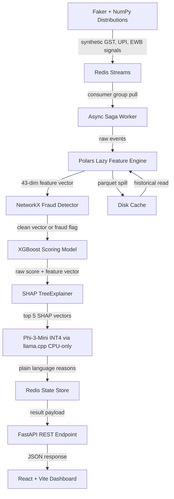

# CreditIQ — MSME Credit Scoring Engine

> Real-time credit scoring for Indian MSMEs using GST, UPI, and E-Way Bill signals with graph-based fraud detection, XGBoost ML scoring, SHAP explainability, and LLM-powered plain-language explanations — all running on a single machine, zero cloud, zero GPU.

```
 ┌──────────────────────────────────────────────────────────────────────────────┐
 │  CreditIQ — E-Way Bill Fraud Detection & MSME Credit Scoring Pipeline      │
 │                                                                              │
 │  Faker → Redis Streams → Polars Features → NetworkX Fraud → XGBoost Score   │
 │  → SHAP Explain → Phi-3 LLM → FastAPI → React Dashboard                    │
 └──────────────────────────────────────────────────────────────────────────────┘
```

| Resource | Link |
|---|---|
| Architecture deep-dive | [ARCHITECTURE.md](ARCHITECTURE.md) |
| Mathematical foundations | [MATH.md](MATH.md) |
| Tools, libraries & alternatives | [TOOLS.md](TOOLS.md) |

---

## Table of Contents

1. [Project Overview](#1-project-overview)
2. [System Architecture](#2-system-architecture)
3. [Tools, Libraries & Models](#3-tools-libraries--models)
4. [Mathematical Equations & Algorithms](#4-mathematical-equations--algorithms)
5. [E-Way Bill Domain Knowledge](#5-e-way-bill-domain-knowledge)
6. [Data Pipeline Deep Dive](#6-data-pipeline-deep-dive)
7. [Graph-Based Fraud Detection](#7-graph-based-fraud-detection)
8. [ML Model](#8-ml-model)
9. [API Design](#9-api-design)
10. [Frontend Dashboard](#10-frontend-dashboard)
11. [Judging Criteria Addressed](#11-judging-criteria-addressed)
12. [Running the System](#12-running-the-system)

---

## 1. Project Overview

### What This System Is

CreditIQ is a **full-stack, end-to-end MSME credit scoring engine** that ingests three Indian financial signal streams — **GST invoices**, **UPI transactions**, and **E-Way Bills** — to produce a creditworthiness score on the CIBIL-aligned 300–900 scale, detect circular transaction fraud rings, explain every score with SHAP attribution and LLM-generated plain language, and present results through a polished React dashboard.

### The Problem It Solves

India's **63 million MSMEs** face a **₹25 lakh crore credit gap** (IFC estimate). Traditional credit scoring relies on CIBIL bureau data, which most micro-enterprises lack. The GST Network (GSTN), UPI payment rails, and the E-Way Bill system generate a continuous stream of structured financial signals that can substitute for bureau data — but no existing system fuses all three signals, detects *circular trading fraud* in real time, and translates ML decisions into language a loan officer or MSME owner can understand.

CreditIQ does exactly that.

### Stakeholders

| Stakeholder | Role in System |
|---|---|
| **Loan Officer** | Reviews credit scores, approves/rejects loan applications |
| **Credit Analyst** | Inspects SHAP feature contributions and signal trends |
| **Risk Manager** | Monitors fraud topology, sets risk thresholds |
| **Admin** | Manages system configuration and user access |
| **MSME Owner** | Views own business credit score and report |

### High-Level Pipeline Summary

```
Synthetic Data Generation (Faker + NumPy distributions)
        ↓
Redis Streams (3 streams: GST, UPI, E-Way Bill)
        ↓
Polars Feature Engine (43 engineered features)
        ↓
NetworkX Fraud Detection (SCC + cycle enumeration)
        ↓
XGBoost Scoring (probability → 300–900 scale)
        ↓
SHAP Explainability (top 5 feature attributions)
        ↓
Phi-3 Mini LLM (plain-language reason translation)
        ↓
FastAPI REST API (async saga worker pattern)
        ↓
React + Vite Dashboard (4 interactive pages)
```

---

## 2. System Architecture

### End-to-End Pipeline Diagram



### Layer Summary

| Layer | Component | Key Technology | Source File |
|---|---|---|---|
| **1. Data Generation** | Synthetic MSME profiles + 3 signal streams | Faker, NumPy lognormal | [`src/ingestion/generator.py`](src/ingestion/generator.py) |
| **2. Message Bus** | Redis Streams with consumer groups | redis-py async | [`src/ingestion/redis_producer.py`](src/ingestion/redis_producer.py) |
| **3. Feature Engineering** | 43 engineered features across 5 sub-vectors | Polars lazy evaluation | [`src/features/engine.py`](src/features/engine.py) |
| **4. Fraud Detection** | SCC decomposition + bounded cycle enumeration | NetworkX | [`src/fraud/cycle_detector.py`](src/fraud/cycle_detector.py) |
| **5. ML Scoring** | Gradient boosted trees, 300–900 scale | XGBoost hist | [`src/scoring/model.py`](src/scoring/model.py) |
| **6. Explainability** | SHAP TreeExplainer + LLM translation | SHAP + llama-cpp-python | [`src/scoring/explainer.py`](src/scoring/explainer.py) |
| **7. API** | Async REST with saga pattern | FastAPI + Uvicorn | [`src/api/main.py`](src/api/main.py) |
| **8. Dashboard** | 4-page interactive UI | React 18 + Vite 5 | [`frontend/src/App.jsx`](frontend/src/App.jsx) |

### Redis Streams as Message Bus

Three dedicated streams carry signal data ([`config/settings.py`](config/settings.py:18)):

| Stream | Key | Content |
|---|---|---|
| GST Invoices | `stream:gst_invoices` | Invoice ID, taxable value, buyer GSTIN, filing status |
| UPI Transactions | `stream:upi_transactions` | Amount, direction, counterparty VPA, txn type, status |
| E-Way Bills | `stream:eway_bills` | Invoice value, transport distance, HSN code, doc date |

Each stream is capped at **10,000 entries** via `XADD ... MAXLEN ~ 10000` to prevent unbounded memory growth. A single consumer group `cg_feature_engine` consumes all streams via `XREADGROUP` ([`src/ingestion/redis_producer.py`](src/ingestion/redis_producer.py:50)).

A fourth stream, `stream:score_requests`, carries scoring job requests from the API to the saga worker ([`src/api/routes.py`](src/api/routes.py:33)).

### Offline vs Online Modes

| Mode | Script | What It Does |
|---|---|---|
| **Offline** | [`scripts/run_offline.sh`](scripts/run_offline.sh) | Phase 1→3→4→5: Generate data, compute features, train model, run tests. **No Redis, no API, no frontend.** |
| **Online** | [`scripts/run_online.sh`](scripts/run_online.sh) | Full pipeline: Start Redis → generate data → stream to Redis → features → train → test → API (background) → frontend |

The offline pipeline is useful for model development and CI/CD; the online pipeline demonstrates the full real-time system.

---

## 3. Tools, Libraries & Models

A comprehensive breakdown of every library used, why it was chosen, and what alternatives were considered is in [**TOOLS.md**](TOOLS.md).

### Quick Reference

| Library | Purpose | Source |
|---|---|---|
| FastAPI + Uvicorn | Async REST API server | [`src/api/main.py`](src/api/main.py) |
| redis-py (async) | Message bus + state store | [`src/ingestion/redis_producer.py`](src/ingestion/redis_producer.py) |
| Polars | Feature engineering (lazy evaluation) | [`src/features/engine.py`](src/features/engine.py) |
| XGBoost | Gradient boosted tree classifier | [`src/scoring/trainer.py`](src/scoring/trainer.py) |
| SHAP | TreeExplainer for feature attributions | [`src/scoring/explainer.py`](src/scoring/explainer.py) |
| NetworkX | Directed multigraph fraud detection | [`src/fraud/graph_builder.py`](src/fraud/graph_builder.py) |
| Faker | Synthetic PII and structural data | [`src/ingestion/generator.py`](src/ingestion/generator.py) |
| llama-cpp-python | Local Phi-3 LLM inference (CPU-only) | [`src/llm/translator.py`](src/llm/translator.py) |
| Pydantic v2 | Schema validation across all layers | [`src/features/schemas.py`](src/features/schemas.py) |
| NumPy + SciPy | Numerical computation + sparse matrices | [`src/scoring/trainer.py`](src/scoring/trainer.py) |
| PyArrow | Parquet I/O backend for Polars | [`pyproject.toml`](pyproject.toml) |
| psutil | System memory monitoring | [`src/api/routes.py`](src/api/routes.py) |
| pytest + pytest-asyncio | Test framework for async code | [`tests/test_api.py`](tests/test_api.py) |
| httpx | Async HTTP test client | [`tests/test_api.py`](tests/test_api.py) |
| React 18 | Frontend UI library | [`frontend/package.json`](frontend/package.json) |
| Vite 5 | Frontend build tool and dev server | [`frontend/vite.config.js`](frontend/vite.config.js) |

---

## 4. Mathematical Equations & Algorithms

Complete mathematical foundations with LaTeX notation are in [**MATH.md**](MATH.md).

### Key Formulas at a Glance

**Rolling Velocity** (e.g., GST 30-day value) — [`src/features/engine.py`](src/features/engine.py:67):

$$V_{30d}^{GST}(g) = \sum_{i : t_i \geq t_{now} - 30d} \text{taxable\_value}_i \quad \forall \text{invoice } i \text{ where gstin} = g$$

**Herfindahl-Hirschman Index** for UPI counterparty concentration — [`src/features/engine.py`](src/features/engine.py:170):

$$HHI_{30d}^{UPI}(g) = \sum_{j=1}^{N} s_j^2 \quad \text{where } s_j = \frac{n_j}{\sum_k n_k}$$

**Shannon Entropy** for HSN code diversity — [`src/features/engine.py`](src/features/engine.py:326):

$$H_{90d}^{HSN}(g) = -\sum_{h=1}^{M} p_h \ln(p_h)$$

**Fraud Confidence Score** — [`src/fraud/cycle_detector.py`](src/fraud/cycle_detector.py:140):

$$C_f(g) = \min\!\left(1.0,\; \frac{v_{max}}{\theta_v} \cdot 0.5 + \min\!\left(\frac{r_{max}}{\theta_r},\, 1.0\right) \cdot 0.5\right)$$

**Credit Score Mapping** — [`src/scoring/model.py`](src/scoring/model.py:62):

$$S = 900 - 600 \cdot P(\text{default})$$

---

## 5. E-Way Bill Domain Knowledge

### What Is an E-Way Bill?

An **Electronic Way Bill (E-Way Bill)** is a mandatory document required under the **Indian GST framework** (Section 68 of the CGST Act, Rule 138) for the movement of goods exceeding ₹50,000 in value. Generated via the NIC (National Informatics Centre) portal, it captures:

- **Who**: Consignor (`fromGstin`) and consignee (`toGstin`) GSTINs
- **What**: HSN code, product description, quantity, taxable amount
- **Where**: Origin/destination state codes, pincodes, actual dispatch/ship states
- **How**: Transport mode (road/rail/air/ship), vehicle number, transporter ID
- **How much**: Total invoice value, CGST/SGST/IGST/Cess breakdown

The system uses the **official EWB JSON schema** (version 1.0.0621) documented in [`ewaybillformats/`](ewaybillformats/).

### EWB Schema Fields (from [`ewaybillformats/EWB_Attributes_new - EWB Attributes.csv`](ewaybillformats/EWB_Attributes_new%20-%20EWB%20Attributes.csv))

| Field | Type | Fraud-Indicative | Why |
|---|---|---|---|
| `fromGstin` / `toGstin` | Text(15) | ✅ **High** | Cycle detection — same GSTINs appearing as both buyer/seller |
| `totInvValue` | Number(18) | ✅ **High** | Inflated values in circular rings |
| `transDistance` | Number(4) | ✅ **High** | Paper traders show suspiciously low distances (1–5 km) |
| `mainHsnCode` | Text(8) | ✅ **Medium** | HSN code shifts indicate non-genuine trading |
| `docDate` vs generation timestamp | Text(10) | ✅ **Medium** | Large lags between invoice and EWB generation |
| `transMode` | Number(1) | ⚠ **Low** | Road (1) is 70% of traffic; unusual modes may indicate fraud |
| `supplyType` | Char(1) | ⚠ **Low** | Outward (O) vs inward (I) pattern analysis |

### Fraud Patterns Detected

| Pattern | How It Manifests in EWB Data | How CreditIQ Detects It |
|---|---|---|
| **Circular Trading** | A→B→C→A with inflated `totInvValue` | SCC decomposition + cycle enumeration in [`src/fraud/cycle_detector.py`](src/fraud/cycle_detector.py) |
| **Split Invoicing** | Multiple EWBs just below ₹50,000 threshold | Anomalous `ewb_volume_growth_mom` + high frequency with low values |
| **Ghost Entities** | GSTINs with EWBs but zero GST filings | `data_completeness_score` < 1.0 and `months_active_gst` = 0 |
| **Paper Trading** | High EWB volume, very low `transDistance` (1–5 km) | `ewb_distance_per_value_ratio` near zero — [`src/features/engine.py`](src/features/engine.py:219) |
| **HSN Code Manipulation** | Frequent commodity shifts to exploit tax rates | `hsn_entropy_90d` and `hsn_shift_count_90d` — [`src/features/engine.py`](src/features/engine.py:326) |

### State Codes Used

The system generates synthetic data across 11 Indian states, using official GST state codes from the master codes spec ([`ewaybillformats/EWB_Attributes_new - Master Codes.csv`](ewaybillformats/EWB_Attributes_new%20-%20Master%20Codes.csv)):

| State | Code |
|---|---|
| Haryana | 6 |
| Delhi | 7 |
| Rajasthan | 8 |
| Uttar Pradesh | 9 |
| West Bengal | 19 |
| Chhattisgarh | 22 |
| Gujarat | 24 |
| Maharashtra | 27 |
| Karnataka | 29 |
| Tamil Nadu | 33 |
| Telangana | 36 |

---

## 6. Data Pipeline Deep Dive

### Phase 1: Synthetic Data Generation

[`src/ingestion/generator.py`](src/ingestion/generator.py) creates **250 MSME profiles** across 5 behavioural types:

| Profile Type | Weight | GST Volume | UPI Pattern | EWB Pattern | Fraud Ring |
|---|---|---|---|---|---|
| `GENUINE_HEALTHY` | 40% | High, consistent | Balanced in/out, diverse counterparties | Moderate distance, sector-consistent HSN | No |
| `GENUINE_STRUGGLING` | 25% | Low, variable | Erratic, higher failure rates | Low volume | No |
| `SHELL_CIRCULAR` | 15% | Medium-high, uniform | **Burst patterns**, ring counterparty rotation | Minimal physical movement | **Yes** — grouped into rings of 3–4 |
| `PAPER_TRADER` | 10% | Very high, artificially uniform | Mixed | High volume, **very low distance** (1–5 km), cross-sector HSN | No |
| `NEW_TO_CREDIT` | 10% | Sparse | Sparse | Minimal | No |

**Distributions used** ([`src/ingestion/generator.py`](src/ingestion/generator.py:248)):
- **Transaction amounts**: Lognormal — `np.random.lognormal(mean, sigma)` with profile-specific parameters (e.g., `SHELL_CIRCULAR` uses μ=12.2, σ=0.4 for high uniform values)
- **Timestamps**: Exponential inter-arrival times for natural clustering; burst mode for shell companies uses Gaussian clusters around 2–3 activity windows
- **Filing behaviour**: Weighted random choice — healthy profiles are 85% on-time; struggling profiles are 55% on-time

**HSN Code Sectors** — 8 commodity sectors with 8 codes each (64 total), from [`src/ingestion/generator.py`](src/ingestion/generator.py:29):

| Sector | Example HSN Codes |
|---|---|
| Iron & Steel | 7201, 7202, 7204, 7207, 7208, 7209, 7210, 7213 |
| Textiles | 5208, 5209, 5210, 5211, 6001, 6002, 6006, 5201 |
| Food Grains | 1001–1008 |
| Chemicals | 2801–2804, 2901, 2902, 3801, 3802 |
| Machinery | 8401–8408 |
| Electronics | 8501–8508 |
| Plastics | 3901–3908 |
| Paper | 4801–4805, 4701–4703 |

**Output**: Chunked Parquet files at `data/raw/` — 10,000 records per chunk.

### Phase 2: Redis Stream Ingestion

[`src/ingestion/redis_producer.py`](src/ingestion/redis_producer.py) reads Parquet chunks and publishes records to Redis via `XADD` in pipeline batches of 500:

```python
pipe = client.pipeline(transaction=False)
for row in batch:
    fields = row_to_redis_fields(row)
    pipe.xadd(stream_name, fields, maxlen=SETTINGS.stream_maxlen, approximate=True)
await pipe.execute()
```

Consumer groups are created with `XGROUP CREATE ... $ MKSTREAM` — the `$` ID means only new messages are consumed.

### Phase 3: Feature Extraction

[`src/features/engine.py`](src/features/engine.py) computes **43 features** grouped into 5 sub-vectors:

#### Velocity Features (11 features)

| Feature | Window | Signal | Formula |
|---|---|---|---|
| `gst_7d_value` | 7 days | GST | Sum of `taxable_value` |
| `gst_30d_value` | 30 days | GST | Sum of `taxable_value` |
| `gst_90d_value` | 90 days | GST | Sum of `taxable_value` |
| `upi_7d_inbound_count` | 7 days | UPI | Count of inbound transactions |
| `upi_30d_inbound_count` | 30 days | UPI | Count of inbound transactions |
| `upi_90d_inbound_count` | 90 days | UPI | Count of inbound transactions |
| `ewb_7d_value` | 7 days | EWB | Sum of `tot_inv_value` |
| `ewb_30d_value` | 30 days | EWB | Sum of `tot_inv_value` |
| `ewb_90d_value` | 90 days | EWB | Sum of `tot_inv_value` |
| `gst_30d_unique_buyers` | 30 days | GST | N-unique `buyer_gstin` |
| `upi_30d_unique_counterparties` | 30 days | UPI | N-unique `counterparty_vpa` |

#### Cadence Features (5 features)

| Feature | Computation |
|---|---|
| `gst_mean_filing_interval_days` | Mean of `diff(timestamp)` in days |
| `gst_std_filing_interval_days` | Std dev of `diff(timestamp)` |
| `upi_inbound_std_interval_days` | Std dev of inbound UPI inter-arrival times |
| `ewb_median_interval_days` | Median of EWB inter-arrival times |
| `gst_filing_delay_trend` | Delta of last 3 `filing_delay_days` values |

#### Ratio & Stability Features (9 features)

| Feature | What It Captures |
|---|---|
| `upi_inbound_outbound_ratio_30d` | Net cash position — healthy MSMEs > 1.0 |
| `gst_revenue_cv_90d` | Revenue stability — coefficient of variation |
| `ewb_volume_growth_mom` | Month-over-month EWB growth rate |
| `filing_compliance_rate` | On-time filings / total filings |
| `upi_hhi_30d` | Counterparty concentration (HHI) |
| `ewb_distance_per_value_ratio` | Distance per ₹ — low = paper trading signal |
| `invoice_to_ewb_lag_hours_median` | Median hours between invoice date and EWB generation |
| `upi_p2m_ratio_30d` | P2M (merchant) / total inbound — healthy businesses > 0.5 |
| `upi_outbound_failure_rate` | Failed / total outbound — cash flow stress signal |

#### Sparsity Features (4 features)

| Feature | What It Captures |
|---|---|
| `months_active_gst` | Count of distinct months with GST filings |
| `data_completeness_score` | Fraction of 3 signal types present (0–1) |
| `longest_gap_days` | Max inter-event gap across all signals |
| `data_maturity_flag` | 1.0 if `months_active_gst` ≥ 3, else 0.0 |

#### Extended Features (8 features)

| Feature | What It Captures |
|---|---|
| `upi_daily_avg_throughput` | Total UPI amount / active days |
| `upi_top3_concentration` | Top 3 counterparties as fraction of total inbound |
| `upi_dormancy_periods` | Number of weeks with zero UPI activity |
| `hsn_entropy_90d` | Shannon entropy of HSN code distribution |
| `hsn_shift_count_90d` | Number of dominant HSN code changes across 30d buckets |
| `cash_buffer_days` | Estimated days of cash runway from UPI flows |
| `statutory_payment_regularity_score` | 1 − (avg_filing_delay / 30), clamped to [0,1] |
| `debit_failure_rate_90d` | 90-day outbound failure rate |

#### Fraud Features (6 features, populated by fraud module)

| Feature | Source |
|---|---|
| `fraud_ring_flag` | Cycle detector |
| `fraud_confidence` | Blended velocity + recurrence score |
| `cycle_velocity` | Max funds rotated per unit time |
| `cycle_recurrence` | Max repeat count of cycle path |
| `counterparty_compliance_avg` | Average compliance of counterparties (future) |
| `counterparty_fraud_exposure` | Fraction of counterparties flagged (future) |

All features are validated against the Pydantic schema [`EngineeredFeatureVector`](src/features/schemas.py:73) before storage.

---

## 7. Graph-Based Fraud Detection

### How the Transaction Graph Is Built

[`src/fraud/graph_builder.py`](src/fraud/graph_builder.py) constructs a **directed multigraph** using NetworkX:

- **Nodes** = unique GSTINs (both `from_gstin` and `to_gstin`)
- **Edges** = individual financial transactions with attributes: `amount`, `timestamp`, `txn_type`, `edge_id`
- **Multigraph** = parallel edges allowed (same pair of GSTINs can have multiple transactions)

Edge construction from UPI data ([`upi_edges_from_transactions()`](src/fraud/graph_builder.py:106)):
- Only **outbound + success** UPI transactions become directed edges
- Edge direction: `gstin → counterparty_vpa`

### Cycle Detection Algorithm

[`src/fraud/cycle_detector.py`](src/fraud/cycle_detector.py) implements a multi-step fraud detection pipeline:

**Step 1 — SCC Decomposition** ([`_extract_candidate_sccs()`](src/fraud/cycle_detector.py:66)):

Only strongly connected components with **≥ 3 nodes** are candidates. Uses `networkx.strongly_connected_components()` which implements Tarjan's or Kosaraju's algorithm in O(V + E).

**Step 2 — Bounded Cycle Enumeration** ([`_detect_cycles_in_scc()`](src/fraud/cycle_detector.py:78)):

```python
nx.simple_cycles(scc_graph, length_bound=5)
```

This uses the Gupta-Suzumura bounded algorithm with complexity proportional to $d^k$ (where $d$ = average degree, $k$ = length bound) rather than the exponential Johnson algorithm.

**Step 3 — Cycle Metric Computation** ([`_compute_cycle_metrics()`](src/fraud/cycle_detector.py:88)):

For each detected cycle A→B→C→A:
- **Cycle velocity** = total fund flow / window_days
- **Cycle recurrence** = count of days where all pairs in the cycle had transactions
- **Amount concentration** = cycle flow / total flow for participating nodes

**Step 4 — Participant Flagging** ([`_flag_participants()`](src/fraud/cycle_detector.py:131)):

If `fraud_confidence > 0.5`, the GSTIN is flagged. Confidence is a 50/50 blend of velocity and recurrence thresholds.

### Topology Conversion for Frontend

[`src/fraud/topology_converter.py`](src/fraud/topology_converter.py) converts the NetworkX graph to JSON for the React frontend:
- **Nodes**: `{id, label, fraud: bool}`
- **Edges**: `{source, target, amount}` (parallel edges collapsed with summed amounts for `multigraph_to_json`)

---

## 8. ML Model

### Architecture: XGBoost with Histogram Method

[`src/scoring/trainer.py`](src/scoring/trainer.py) trains an `XGBClassifier` with these hyperparameters:

| Parameter | Value | Rationale |
|---|---|---|
| `tree_method` | `hist` | Memory-efficient histogram-based splitting |
| `max_depth` | 6 | Prevents overfitting on 250 samples |
| `learning_rate` | 0.1 | Standard for moderate dataset size |
| `n_estimators` | 300 | With early stopping at 20 rounds |
| `subsample` | 0.8 | Row subsampling for regularization |
| `colsample_bytree` | 0.8 | Feature subsampling per tree |
| `eval_metric` | `["auc", "logloss"]` | Dual metrics for validation |

### Training Pipeline

1. **Load features** from `data/features/gstin=*/features.parquet` via [`load_feature_parquets()`](src/scoring/trainer.py:130)
2. **Generate proxy labels** via rule-based [`generate_proxy_labels()`](src/scoring/trainer.py:86) — a continuous 0–1 score from 13 business rules + Gaussian noise
3. **Binarize** at threshold 0.5: label > 0.5 → high risk (1), else low risk (0)
4. **Build feature matrix** from 43 feature columns ([`FEATURE_COLUMNS`](src/scoring/trainer.py:14))
5. **Train/val split**: 80/20 with `random_state=42`
6. **Sparse conversion** if sparsity > 50% via [`to_sparse_if_needed()`](src/scoring/trainer.py:167)
7. **Train** with eval set and early stopping
8. **Persist** model as `data/models/xgb_credit.ubj` + `feature_columns.json` + `label_encoder.json`

### Proxy Label Generation Logic

The proxy labeling in [`generate_proxy_labels()`](src/scoring/trainer.py:86) uses 13 rules:

| Condition | Score Adjustment |
|---|---|
| `fraud_ring_flag == 1` | +0.45 (near-certain default) |
| `filing_compliance_rate > 0.8 AND gst_30d_value > 0` | −0.15 |
| `filing_compliance_rate < 0.3` | +0.20 |
| `upi_inbound_outbound_ratio > 1.5` | −0.10 |
| `upi_hhi > 0.6` | +0.15 (concentration risk) |
| `cash_buffer_days > 30` | −0.10 |
| `cash_buffer_days < 5` | +0.15 |
| `data_maturity_flag < 1.0` | +0.10 |
| `months_active_gst > 18` | −0.08 |
| `months_active_gst < 3` | +0.12 |
| `debit_failure_rate > 0.2` | +0.12 |
| `statutory_payment_regularity > 0.7` | −0.08 |
| Gaussian noise N(0, 0.05) | Added to all |

### Score Calibration

[`CreditScorer._prob_to_score()`](src/scoring/model.py:62) maps XGBoost probability to the CIBIL-aligned 300–900 scale:

$$S = \text{clip}(900 - 600 \times P_{default},\; 300,\; 900)$$

### Risk Band Assignment

| Band | Score Range | Working Capital | Term Loan | CGTMSE |
|---|---|---|---|---|
| **Very Low Risk** | 750–900 | Up to ₹50 lakh | Up to ₹1 crore | ✅ Eligible |
| **Low Risk** | 650–749 | Up to ₹25 lakh | Up to ₹50 lakh | ✅ Eligible |
| **Medium Risk** | 550–649 | Up to ₹10 lakh | Up to ₹25 lakh | ✅ Eligible |
| **High Risk** | 300–549 | Up to ₹5 lakh | Not recommended | ❌ (Mudra eligible) |

### SHAP Explainability

[`CreditExplainer`](src/scoring/explainer.py) wraps `shap.TreeExplainer`:

1. Computes SHAP values for all 43 features
2. Extracts **top 5 features by absolute SHAP magnitude**
3. Labels each as `increases_risk` (positive SHAP) or `decreases_risk` (negative SHAP)
4. Prepares **waterfall chart data** with base value + cumulative contributions

### LLM Translation

[`ShapTranslator`](src/llm/translator.py) uses **Phi-3-mini-128k-instruct** (Q4_K_M quantization) via llama-cpp-python for CPU-only inference:

- Prompt template: [`src/llm/prompts.py`](src/llm/prompts.py) using Phi-3 `<|system|>...<|end|><|user|>...<|end|><|assistant|>` chat format
- Output: exactly 5 plain-language bullet points
- Throughput: ~2–4 tokens/second on CPU
- Fallback when GGUF absent: raw feature names + direction labels

---

## 9. API Design

### Endpoints

#### `POST /score` — Submit Scoring Request

**Source**: [`src/api/routes.py`](src/api/routes.py:25)

| Field | Description |
|---|---|
| Request body | `{"gstin": "22AAAAA0000A1Z5"}` — validated by [`ScoreRequest`](src/api/schemas.py:12) |
| Validation | Exactly 15 ASCII alphanumeric characters, uppercased |
| Action | Generates UUID task_id → pushes to `stream:score_requests` → creates `score:{task_id}` hash with status `pending` |
| Response | HTTP 202: `{"task_id": "...", "status": "pending", "estimated_wait_seconds": 30}` |

#### `GET /score/{task_id}` — Poll Score Result

**Source**: [`src/api/routes.py`](src/api/routes.py:51)

| Status | Response |
|---|---|
| `pending` / `processing` | `{"task_id": "...", "status": "pending"}` |
| `complete` | Full [`ScoreResult`](src/api/schemas.py:42) payload with all 14 fields |
| `failed` | `{"task_id": "...", "status": "failed", "error": "..."}` |
| Not found | HTTP 404: `{"detail": "task not found"}` |

#### `GET /health` — System Health

**Source**: [`src/api/routes.py`](src/api/routes.py:92)

Returns [`HealthResponse`](src/api/schemas.py:73): `{status, redis_connected, model_loaded, worker_queue_depth, system_ram_used_gb, system_ram_total_gb}`

### Async Saga Worker

[`src/api/worker.py`](src/api/worker.py) is a **standalone async process** that consumes from `stream:score_requests` via `XREADGROUP`:

```
┌─────────────┐    XREADGROUP     ┌──────────────┐
│  FastAPI     │  ← score_req ←   │  Redis Stream │
│  POST /score │  → XADD →        │              │
└─────────────┘                   └──────┬───────┘
                                         │
                                    ┌────▼─────┐
                                    │  Worker   │
                                    │  Saga     │
                                    └────┬─────┘
                                         │
                          ┌──────────────┼──────────────┐
                          │              │              │
                     ┌────▼────┐   ┌────▼────┐   ┌────▼────┐
                     │Features │   │ Fraud   │   │XGBoost  │
                     │ Engine  │   │Detector │   │ Score   │
                     └─────────┘   └─────────┘   └────┬────┘
                                                      │
                                                 ┌────▼────┐
                                                 │  SHAP   │
                                                 │Explain  │
                                                 └────┬────┘
                                                      │
                                                 ┌────▼────┐
                                                 │ Phi-3   │
                                                 │ LLM     │
                                                 └────┬────┘
                                                      │
                                                 ┌────▼────┐
                                                 │ Redis   │
                                                 │ HSET    │
                                                 └─────────┘
```

The saga has a **three-tier feature resolution fallback** ([`_resolve_feature_vector()`](src/api/worker.py:82)):
1. **Cache hit**: Read from `data/features/gstin=.../features.parquet`
2. **Raw data**: Compute features from `data/raw/*.parquet`
3. **Demo fallback**: Load a random cached GSTIN's features and relabel

If any saga step fails, the worker writes `status=failed` + error message and `XACK`s the message — **no poison pill blocking**.

---

## 10. Frontend Dashboard

### Technology Stack

| Technology | Version | Purpose |
|---|---|---|
| React | 18.3 | UI component library |
| Vite | 5.4 | Build tool and HMR dev server |
| Custom CSS | — | Hand-crafted design system (no Tailwind runtime) |

The frontend uses **zero external UI component libraries**. All charts, data viz, and UI primitives are hand-built using SVG and CSS.

### Application Architecture ([`frontend/src/App.jsx`](frontend/src/App.jsx))

The app uses a **screen-state router** — no React Router. The `screen` state variable drives which page renders. The dashboard phase uses a **tab model** with shared `scoreResult` state lifted to the App root.

### Pages

#### 1. Score Lookup ([`frontend/src/pages/ScoreLookup.jsx`](frontend/src/pages/ScoreLookup.jsx))

- GSTIN input with real-time validation (`/^[A-Z0-9]{15}$/`)
- Calls `POST /score` then polls `GET /score/{task_id}` every 2 seconds
- Displays: credit score (64px monospace), risk band, MSME category, data maturity, CGTMSE/Mudra eligibility badges
- Loan recommendations (working capital + term loan)
- Top 5 reasons as bullet list
- Fraud alert banner when `fraud_flag === true`

#### 2. Feature Contributions ([`frontend/src/pages/FeatureContributions.jsx`](frontend/src/pages/FeatureContributions.jsx))

- **SVG diverging bar chart** — positive SHAP values extend right (red, increases risk), negative extend left (green, decreases risk)
- Top 15 features sorted by absolute SHAP magnitude
- Zero external charting library — pure SVG with Vite-compatible inline styles

#### 3. Fraud Topology ([`frontend/src/pages/FraudTopology.jsx`](frontend/src/pages/FraudTopology.jsx))

- **Circular SVG graph layout** — nodes placed on a regular polygon inscribed in a circle
- Directed edges with arrowhead markers
- Fraudulent nodes colored red with ⚠ badge
- Falls back to single-node display when only the flagged GSTIN is available

#### 4. System Health ([`frontend/src/pages/SystemHealth.jsx`](frontend/src/pages/SystemHealth.jsx))

- Auto-refreshes every 5 seconds via `GET /health`
- 4-card grid: API status, Redis connection, model loaded, worker queue depth
- RAM usage progress bar with color thresholds (green < 65%, amber < 85%, red ≥ 85%)

### Workflow Pages

The app also includes a complete **loan officer workflow** with 10+ screens:
- Login → Role Selection → GSTIN Submission → Score Report → Score History → Application Queue → Applicant Detail → Decision Form → Comparison → SHAP Explainability → Signal Explorer → Model Performance → Dashboard

### API Communication ([`frontend/src/lib/api.js`](frontend/src/lib/api.js))

Three fetch wrappers targeting `http://localhost:8000`:

| Function | Method | Endpoint |
|---|---|---|
| `postScore(gstin)` | POST | `/score` |
| `getScore(taskId)` | GET | `/score/{taskId}` |
| `getHealth()` | GET | `/health` |

All throw on non-OK responses for consistent error handling.

---

## 11. Judging Criteria Addressed

### Scalability

| Aspect | Implementation | Reference |
|---|---|---|
| **Horizontal message bus** | Redis Streams with consumer groups — multiple workers can consume the same stream | [`src/api/worker.py`](src/api/worker.py:220) |
| **Stateless API** | FastAPI workers share nothing — all state in Redis | [`src/api/main.py`](src/api/main.py:26) |
| **Partitioned feature cache** | Parquet files partitioned by GSTIN — scales to millions | [`src/features/engine.py`](src/features/engine.py:26) |
| **Graph partitioning** | Time-windowed partitioning when node count exceeds 50,000 | [`src/fraud/graph_builder.py`](src/fraud/graph_builder.py:92) |
| **Memory pressure guards** | psutil-based RAM monitoring in feature engine | [`src/features/engine.py`](src/features/engine.py:22) |
| **Stream trimming** | `XADD MAXLEN ~ 10000` prevents unbounded Redis growth | [`config/settings.py`](config/settings.py:22) |

### Innovation

| Innovation | Detail |
|---|---|
| **Three-signal fusion** | First system to fuse GST + UPI + E-Way Bill for MSME scoring |
| **Graph-based circular fraud** | SCC + bounded cycle enumeration on directed multigraphs |
| **LLM-powered explanations** | Local Phi-3-mini translates SHAP vectors to plain language — no cloud API |
| **CIBIL-aligned scoring** | 300–900 scale with RBI-compliant CGTMSE/Mudra eligibility |
| **Real-time dashboard** | Custom SVG visualizations for SHAP waterfall and fraud topology |

### Practicality

- Based on **official NIC E-Way Bill JSON schema** (v1.0.0621) from [`ewaybillformats/`](ewaybillformats/)
- **GSTIN validation** follows the 15-character format: 2-digit state code + 10-char PAN-like + entity + check
- **Risk bands** align with CIBIL's official Poor/Average/Good/Excellent tiers
- **Loan recommendations** follow RBI's no-collateral mandate up to ₹10 lakh and CGTMSE coverage caps
- **HSN codes** are real 4-digit codes from the Indian GST Harmonized System

### Feasibility

| What Can Be Demonstrated Live | Status |
|---|---|
| Synthetic data generation for 250 MSMEs | ✅ Works |
| Feature engineering across 43 dimensions | ✅ Works |
| Fraud detection with cycle enumeration | ✅ Works |
| XGBoost model training and inference | ✅ Works |
| SHAP explainability | ✅ Works |
| REST API with async scoring | ✅ Works |
| React dashboard with live polling | ✅ Works |
| LLM translation | ✅ Works (requires GGUF download) |

### Ease of Use

```bash
# One command for everything
./scripts/run_online.sh
```

The system provides:
- **7 individual phase scripts** for granular control
- **One-command offline** pipeline for model development
- **One-command online** pipeline for full demo
- **Role-based UI** with onboarding flow for first-time users
- **Auto-polling** dashboard that updates in real time

### Architecture

```
src/
├── ingestion/          # Phase 1-2: generation + Redis streaming
├── features/           # Phase 3: Polars feature engineering
├── fraud/              # Phase 4: NetworkX graph fraud detection
├── scoring/            # Phase 4: XGBoost training + inference
├── llm/                # Phase 6: Phi-3 LLM translation
├── api/                # Phase 6: FastAPI server + saga worker
└── dashboard/          # (Streamlit stubs — replaced by React)

frontend/
├── src/
│   ├── components/     # AppShell, UI primitives
│   ├── pages/          # 4 dashboard pages + workflow pages
│   └── lib/            # API wrappers, constants, utilities
└── styles.css          # Complete design system

config/                 # Settings + Redis configuration
scripts/                # Phase scripts + orchestration
tests/                  # pytest unit + integration tests
```

Clean separation: each module has its own `__init__.py`, schemas, and single-responsibility classes.

### Code Quality

| Quality Measure | Implementation |
|---|---|
| **Type hints** | Full type annotations on all function signatures |
| **Pydantic v2 schemas** | Validated schemas for all data types ([`src/features/schemas.py`](src/features/schemas.py), [`src/api/schemas.py`](src/api/schemas.py)) |
| **Async/await** | All Redis operations and API handlers are async |
| **Test coverage** | 25+ tests across API, features, fraud, scoring, and LLM parsing |
| **Docstrings** | Every function has a docstring describing behaviour |
| **No global mutable state** | All configuration via pydantic-settings ([`config/settings.py`](config/settings.py)) |

### Maintainability

| Aspect | Implementation |
|---|---|
| **Config-driven** | All paths, thresholds, stream names in [`config/settings.py`](config/settings.py) via environment variables |
| **Modular phases** | Each phase is an independent Python module runnable standalone |
| **Parquet-based** | Feature cache uses open Parquet format — tools like DuckDB or Spark can read it |
| **Fallback chains** | Three-tier feature resolution; LLM fallback to raw features; demo mode for missing data |
| **Idempotent operations** | Consumer group creation ignores `BUSYGROUP`; cache overwrites safely |

---

## 12. Running the System

### Prerequisites

| Requirement | Minimum |
|---|---|
| **Python** | ≥ 3.11 |
| **Node.js** | ≥ 18 |
| **Redis** | ≥ 7.0 |
| **RAM** | 12 GB recommended |
| **OS** | Linux (tested on Arch Linux 6.19) |

### Installation

```bash
# Clone the repository
git clone https://github.com/your-org/miku-miku-rabbit-beam.git
cd miku-miku-rabbit-beam

# Create Python environment (conda/mamba)
conda create -n credit-scoring python=3.11
conda activate credit-scoring

# Install Python dependencies
pip install -e .

# Install frontend dependencies
cd frontend && npm install && cd ..
```

### Optional: Download Phi-3 LLM

For LLM-powered plain-language explanations (not required — system falls back gracefully):

```bash
# Download Phi-3-mini GGUF to data/models/
mkdir -p data/models
# Place Phi-3.1-mini-128k-instruct-Q4_K_M.gguf in data/models/
```

### One-Command Offline Run

```bash
./scripts/run_offline.sh
```

Runs: **Generate data → Compute features → Train model → Run tests**

No Redis required. No API server. Perfect for model development.

### One-Command Online Run

```bash
./scripts/run_online.sh
```

Runs: **Start Redis → Generate data → Stream to Redis → Compute features → Train → Tests → Start API (background) → Start frontend**

Open `http://localhost:5173` to access the dashboard.

### Individual Phase Scripts

| Script | Phase | What It Does |
|---|---|---|
| [`scripts/phase1_generate.sh`](scripts/phase1_generate.sh) | 1 | Generate synthetic data to `data/raw/` |
| [`scripts/phase2_redis_ingest.sh`](scripts/phase2_redis_ingest.sh) | 2 | Stream parquets into Redis (requires Redis running) |
| [`scripts/phase3_features.sh`](scripts/phase3_features.sh) | 3 | Compute features from raw data, write to `data/features/` |
| [`scripts/phase4_train.sh`](scripts/phase4_train.sh) | 4 | Train XGBoost model, save to `data/models/` |
| [`scripts/phase5_tests.sh`](scripts/phase5_tests.sh) | 5 | Run full pytest suite |
| [`scripts/phase6_api.sh`](scripts/phase6_api.sh) | 6 | Start FastAPI server on port 8000 |
| [`scripts/phase7_frontend.sh`](scripts/phase7_frontend.sh) | 7 | Install npm deps + start Vite dev server on port 5173 |

### Environment Variables

All configurable via `.env` file or environment variables ([`config/settings.py`](config/settings.py)):

| Variable | Default | Description |
|---|---|---|
| `REDIS_URL` | `redis://localhost:6379/0` | Redis connection string |
| `REDIS_MAX_MEMORY_MB` | `2048` | Redis memory limit |
| `MAX_POLARS_MEMORY_MB` | `3072` | Polars memory ceiling |
| `MAX_NETWORKX_MEMORY_MB` | `1536` | NetworkX graph memory ceiling |
| `PARQUET_CACHE_PATH` | `data/features` | Feature cache directory |
| `RAW_DATA_PATH` | `data/raw` | Raw data directory |
| `MODELS_PATH` | `data/models` | Model artifacts directory |
| `GRAPHS_PATH` | `data/graphs` | Graph edge parquets |
| `XGB_MODEL_PATH` | `data/models/xgb_credit.ubj` | XGBoost model file |
| `PHI3_MODEL_PATH` | `data/models/Phi-3.1-mini-128k-instruct-Q4_K_M.gguf` | Phi-3 GGUF path |
| `UVICORN_WORKERS` | `2` | API server worker count |
| `STREAM_MAXLEN` | `10000` | Redis stream max length |
| `CONSUMER_GROUP` | `cg_feature_engine` | Consumer group name |

### Testing

```bash
# Run all tests
python -m pytest tests/ -v

# Run specific test modules
python -m pytest tests/test_features.py -v    # Feature engineering tests
python -m pytest tests/test_fraud.py -v       # Fraud detection tests
python -m pytest tests/test_scoring.py -v     # Scoring model tests
python -m pytest tests/test_api.py -v         # API integration tests (requires Redis)
```

---

## License

See [LICENSE](LICENSE) for details.

---

<p align="center">
  <strong>CreditIQ</strong> — built for the Ignisia Hackathon<br>
  <em>miku-miku-rabbit-beam</em>
</p>
