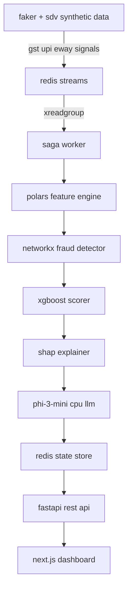

# miku-miku-rabbit-beam

## msme alternative credit scoring engine

a single-machine, event-driven pipeline that produces trust scores for indian micro, small, and medium enterprises that have no credit bureau history. built for loan officers and credit analysts at indian nbfcs and fintechs targeting the credit-invisible msme segment.

the engine replaces the cibil score with a trust score derived from four pillars of real economic activity: upi transaction patterns, e-way bill goods movement, cash flow hygiene from bank statements, and network fraud detection via counterparty graph analysis. zero cloud. zero paid apis. zero gpu required.

---

## architecture



---

## tech stack

| layer | technology | notes |
|---|---|---|
| api framework | fastapi + uvicorn | 2 workers max |
| message broker | redis streams (valkey 9) | maxmemory 2gb, allkeys-lru |
| feature engineering | polars lazy eval | parquet spill, no pandas |
| fraud detection | networkx | scc + simple_cycles, cpu only |
| scoring model | xgboost hist | sparse dmatrix, cpu only |
| explainability | shap treeexplainer | top 5 feature attribution |
| local llm | phi-3-mini q4_k_m gguf | cpu-only via llama-cpp-python |
| frontend | next.js 14 + typescript + tailwind | user-designed, port 3000 |
| backend | python 3.11 via miniforge3 | |

---

## prerequisites

- arch linux or compatible linux distribution
- python 3.11 via miniforge3 (mamba binary at `/home/cyclops/miniforge3/bin/mamba`)
- node.js 20 or later
- redis/valkey installed via pacman
- 12gb system ram minimum
- nvidia rtx 2060 or equivalent is optional, the system runs fully on cpu

---

## backend quick start

```bash
# install system dependencies
sudo pacman -S redis nodejs npm

# create conda environment
/home/cyclops/miniforge3/bin/mamba create -n credit-scoring python=3.11 -y
mamba activate credit-scoring

# install python package in editable mode
pip install -e .

# start redis/valkey with custom config
redis-server config/redis.conf --daemonize yes

# download phi-3-mini gguf model
pip install huggingface-hub
huggingface-cli download microsoft/Phi-3-mini-128k-instruct-gguf \
  Phi-3-mini-128k-instruct-q4.gguf \
  --local-dir data/models/

# generate synthetic msme data
python -m src.ingestion.generator

# stream data into redis
python -m src.ingestion.redis_producer

# start saga worker (separate terminal)
python -m src.api.worker

# start api server
uvicorn src.api.main:app --host 0.0.0.0 --port 8000 --workers 2
```

---

## frontend quick start

```bash
cd frontend
npm install
npm run dev
```

the fastapi backend runs on port 8000. the next.js dev server runs on port 3000. cors is configured in fastapi to allow requests from localhost:3000. the user implements all ui components and pages.

---

## api reference

| method | endpoint | description |
|---|---|---|
| post | /score | submit gstin for scoring, returns 202 with task_id |
| get | /score/{task_id} | poll for score result |
| get | /health | system health check |

### example request

```json
POST /score
{"gstin": "22AAAAA0000A1Z5"}
```

### example response when complete

```json
{
  "task_id": "uuid",
  "gstin": "22AAAAA0000A1Z5",
  "credit_score": 723,
  "risk_band": "low risk",
  "top_reasons": [
    "strong 30 day upi inflow velocity indicates healthy cash receipts",
    "gst filing delay trend is improving over last 3 periods",
    "eway bill volume shows consistent month over month growth",
    "upi inbound to outbound ratio suggests net positive cash position",
    "no circular transaction patterns detected in counterparty network"
  ],
  "recommended_loan": {"amount_inr": 1500000, "tenure_months": 24},
  "fraud_flag": false,
  "fraud_details": null,
  "score_freshness": "2026-04-03t13:12:45+05:30",
  "data_maturity_months": 8
}
```

---

## documentation index

| document | path | purpose |
|---|---|---|
| architecture blueprint | markdownstochat/archi.md | full system design and component communication map |
| execution phases | markdownstochat/02_EXECUTION_PHASES.md | 8-phase implementation roadmap |
| progress tracker | markdownstochat/03_PROGRESS_TRACKER.md | current task status and phase completions |
| system constraints | markdownstochat/00_SYSTEM_CONSTRAINTS.md | memory budgets, code style rules, dependency pins |
| signal intelligence | markdownstochat/04_SIGNAL_INTELLIGENCE.md | domain knowledge, feature rationale, fraud detection logic |
| database schema | markdownstochat/05_DATABASE_SCHEMA.md | all storage layer schemas (redis, parquet, models, graph edges) |
| e-way bill schema | markdownstochat/06_EWAYBILL_SCHEMA.md | indian government ewb api schema reference with validation rules |

---

## hardware requirements

- cpu: multi-core x86_64 processor
- ram: 12gb minimum, all components have hard memory ceilings enforced in code
- gpu: nvidia rtx 2060 6gb vram is optional. all inference runs on cpu. llama-cpp-python uses n_gpu_layers=0
- storage: ssd recommended for parquet cache read/write performance

---

## current status

phase 0 (project scaffolding) is complete. phase 1 (synthetic data generation) is in progress.

see [`markdownstochat/02_EXECUTION_PHASES.md`](markdownstochat/02_EXECUTION_PHASES.md) for the full 8-phase implementation plan and [`markdownstochat/03_PROGRESS_TRACKER.md`](markdownstochat/03_PROGRESS_TRACKER.md) for current task-level status.
