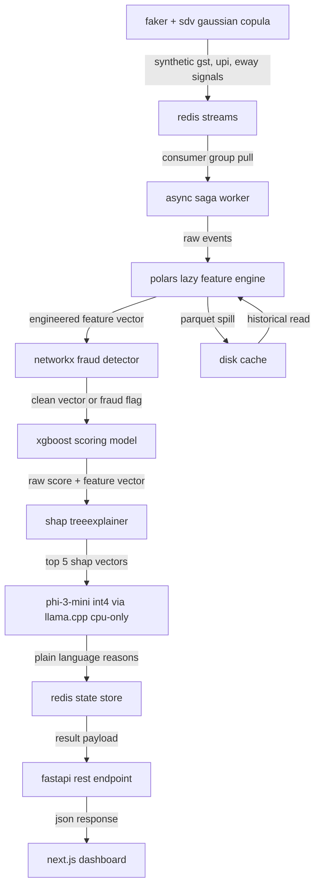
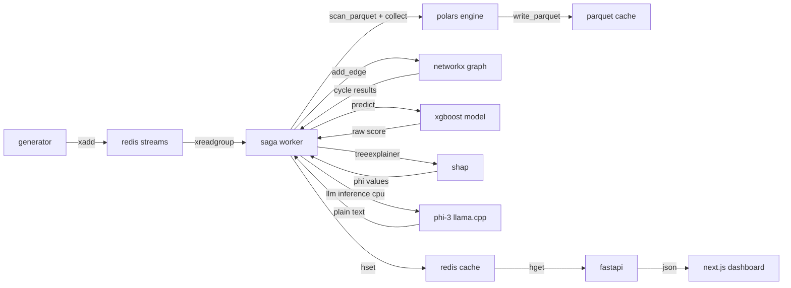

# architecture blueprint

## system overview

the engine is a single-machine, event-driven credit scoring pipeline. it ingests synthetic msme financial signals, engineers time-series features, detects circular fraud topologies, scores creditworthiness via gradient boosting, translates predictions to plain language via a local quantized llm, and serves results through an async rest api with a real-time dashboard.

all components execute on one arch linux machine with 12gb ram. zero cloud. zero paid apis. zero gpu required.

## high-level data flow



## layer 1, synthetic data generation

### purpose
generate mathematically realistic msme financial signals locally without any external data source.

### components

faker handles structural pii generation.
- gstin identifiers following the 15-character format
- upi virtual payment addresses
- business names and geographic metadata
- timestamps with realistic temporal distribution

sdv gaussian copula synthesizer handles correlated numerical generation.
- transaction amounts with fat-tailed distributions and excess kurtosis
- volatility clustering in cash flow sequences
- cross-signal temporal correlations where eway bill spikes precede gst invoice generation which precedes upi payment receipt
- multivariate dependency structure preserved across all signal types

### data schema

three primary signal streams are generated.

gst invoice stream fields: gstin, invoice_id, timestamp, taxable_value, gst_amount, buyer_gstin, filing_status, filing_delay_days

upi transaction stream fields: gstin, vpa, timestamp, amount, direction as inbound or outbound, counterparty_vpa, txn_type

eway bill stream fields: gstin, eway_id, timestamp, consignment_value, distance_km, vehicle_type, origin_state, dest_state

### memory protocol
synthetic generation runs as a batch preprocessor. it generates data in chunks of 10000 records, serializes each chunk to parquet, then streams records into redis. the generator process must not hold more than 500mb in memory at any point.

## layer 2, local message broker

### purpose
simulate real-time high-velocity event ingestion using redis streams as a lightweight local message broker.

### topology

three dedicated redis streams.
- stream:gst_invoices
- stream:upi_transactions
- stream:eway_bills

each stream is capped via xadd maxlen ~ 10000 to prevent unbounded memory growth.

### consumer groups

one consumer group per stream named cg_feature_engine. the async saga worker reads from all three streams using xreadgroup. messages are acknowledged after successful feature computation via xack.

### redis configuration

```
maxmemory 2gb
maxmemory-policy allkeys-lru
save ""
appendonly no
```

persistence is disabled because the synthetic data is reproducible. if redis crashes the generator simply replays. this saves disk io and memory overhead.

## layer 3, feature engineering

### purpose
transform raw event streams into predictive velocity, cadence, and volume features suitable for gradient boosting input.

### engine
polars with lazy evaluation exclusively. zero pandas usage anywhere in the pipeline.

### feature categories

velocity features computed via rolling temporal windows.
- 7d, 30d, 90d rolling sum of gst taxable value
- 7d, 30d, 90d rolling count of upi inbound transactions
- 7d, 30d, 90d rolling sum of eway bill consignment value
- 30d rolling unique buyer count from gst invoices
- 30d rolling unique counterparty count from upi transactions

cadence features computed via temporal differencing.
- mean days between consecutive gst filings
- standard deviation of days between upi inbound receipts
- median days between eway bill generation events
- gst filing delay trend over last 3 filing periods

ratio and stability features.
- upi inbound to outbound ratio over 30d
- gst revenue coefficient of variation over 90d
- eway volume growth rate month over month
- filing compliance rate as on-time filings divided by total due filings

sparsity-aware features.
- months of active gst history as count of months with at least one filing
- data completeness score as fraction of expected signals actually present
- longest consecutive gap in days between any two transactions

### sparse data handling

1. missing rolling windows filled with zero via fill_null of 0 because absence means zero activity not unknown activity
2. forward fill applied only to cadence features where a gap represents continuation of prior rhythm
3. features requiring minimum history of 3 months receive a data_maturity_flag feature that the model learns to weight
4. all feature computation uses polars lazy with streaming collect to stay within 3gb

### parquet cache protocol

each gstin maintains a partitioned parquet file at data/features/gstin=xxxx/features.parquet. the feature engine reads the cached partition, appends new events, recomputes rolling windows, writes back. this ensures only delta computation occurs, keeping memory bounded.

## layer 4, fraud detection

### purpose
identify circular transaction topologies where groups of msmes rotate funds to artificially inflate scores.

### approach
purely algorithmic cpu-bound graph analysis using networkx. zero gpu usage. zero gnn usage.

### graph construction

a directed multigraph is built where.
- nodes represent unique gstins
- directed edges represent financial flows from the upi transaction stream and eway bill stream
- edge attributes include amount, timestamp, and transaction type

### detection algorithm

step 1, construct the directed graph from the upi outbound transaction edges.

step 2, decompose into strongly connected components via networkx kosaraju or tarjan algorithm. only sccs with 3 or more nodes are candidates for circular fraud.

step 3, within each qualifying scc, execute networkx simple_cycles with length_bound of 5. this invokes the gupta-suzumura bounded algorithm with complexity proportional to d raised to the power k rather than the exponential johnson algorithm.

step 4, for each detected cycle, compute.
- cycle velocity as total funds rotated per unit time
- cycle recurrence as how many times the same cycle path repeats
- cycle amount concentration as ratio of cycle flow to total flow for participating nodes

step 5, if cycle_velocity exceeds threshold or cycle_recurrence exceeds 3 within 30 days, flag all participating gstins with fraud_ring_flag set to true and a fraud_confidence score.

### memory protocol
the graph is built from parquet edge lists on disk. only the relevant scc subgraph is loaded for cycle detection. after detection the subgraph is deleted. total graph memory must not exceed 1.5gb.

## layer 5, credit scoring model

### purpose
produce a continuous credit risk score on a 300 to 900 scale from the engineered feature vector.

### model
xgboost with hist tree method. lightgbm is an acceptable alternative. both handle sparse input natively and learn default branch directions for missing values.

### training data strategy

the model trains on synthetically generated labeled data where labels are derived from a rule-based proxy.
- gstins with high velocity, low filing delay, high compliance, no fraud flags receive scores in 700 to 900 range
- gstins with declining velocity, increasing delays, moderate sparsity receive scores in 500 to 700 range
- gstins with fraud flags, extreme sparsity, zero recent activity receive scores in 300 to 500 range

the proxy labels are noisy by design. the model learns the nonlinear boundaries that the rules cannot capture.

### inference pipeline

1. receive engineered feature vector as scipy sparse csr if sparsity exceeds 50 percent or dense numpy array otherwise
2. run xgboost predict to get raw probability
3. map probability to 300 to 900 scale via linear transformation where 0.0 maps to 900 and 1.0 maps to 300 because higher probability of default means lower score
4. assign risk band label. 300 to 500 is high risk, 500 to 650 is medium risk, 650 to 750 is low risk, 750 to 900 is very low risk

### loan recommendation logic

based on score and risk band.
- very low risk, recommended amount up to 25 lakh, tenure up to 36 months
- low risk, recommended amount up to 15 lakh, tenure up to 24 months
- medium risk, recommended amount up to 5 lakh, tenure up to 12 months
- high risk, no recommendation, manual review required

### memory protocol
model loaded once at worker startup. occupies approximately 50 to 200mb depending on tree count. inference is cpu-only.

## layer 6, explainability

### purpose
decompose each score into its top contributing factors using shap and translate to plain language.

### shap computation

shap treeexplainer runs on the xgboost model with the input feature vector. it returns phi values for every feature. the top 5 features by absolute shap magnitude are extracted with their direction as positive risk increase or negative risk decrease.

### llm translation

the top 5 shap feature name and value pairs are formatted into a structured prompt and passed to phi-3-mini running locally via llama.cpp.

model specification.
- model: phi-3-mini-128k-instruct
- format: gguf q4_k_m quantization
- vram usage: 0gb, cpu-only inference
- inference engine: llama-cpp-python with n_gpu_layers=0

prompt structure.
- system message instructs the model to act as a backend financial signal translator
- user message contains the gstin, the score, and the top 5 shap features with values and directions
- model must return exactly 5 short bullet points in plain language
- model is forbidden from generating conversational filler or markdown formatting

### cpu inference note

the llm runs entirely on cpu. expected throughput is approximately 2 to 4 tokens per second on a modern multi-core x86. this is acceptable for the batch explainability use case. no vram sequencing protocol is required because no gpu is used.

## layer 7, api orchestration

### purpose
expose the scoring pipeline as a non-blocking rest api using the saga pattern with redis as the state store.

### framework
fastapi with uvicorn, 2 workers maximum to respect ram budget.

### endpoints

post /score
- accepts json body with gstin field
- validates via pydantic
- generates a unique task_id
- pushes scoring request to redis stream stream:score_requests
- creates pending entry in redis hash score:task_id with status pending
- returns http 202 with task_id and estimated wait time

get /score/task_id
- reads redis hash score:task_id
- if status is pending returns http 200 with status pending
- if status is complete returns the full scoring payload
- if status is failed returns error details

get /health
- returns system memory usage, redis connection status, model loaded status

### saga worker lifecycle

the saga worker is a dedicated async python process separate from the fastapi server. it runs as an asyncio loop that.

1. reads from stream:score_requests via xreadgroup
2. fetches or generates synthetic signals for the requested gstin
3. runs polars feature engineering
4. runs networkx fraud detection
5. runs xgboost inference
6. runs shap computation
7. runs phi-3 llm translation on cpu
8. writes complete result to redis hash score:task_id with status complete
9. acknowledges the stream message via xack

if any step fails the worker writes status failed with error details to the redis hash. this is the compensation leg of the saga.

### response schema

```json
{
  "task_id": "uuid",
  "gstin": "22AAAAA0000A1Z5",
  "credit_score": 723,
  "risk_band": "low risk",
  "top_reasons": [
    "strong 30 day upi inflow velocity indicates healthy cash receipts",
    "gst filing delay trend is improving over last 3 periods",
    "eway bill volume shows consistent month over month growth",
    "upi inbound to outbound ratio suggests net positive cash position",
    "no circular transaction patterns detected in counterparty network"
  ],
  "recommended_loan": {
    "amount_inr": 1500000,
    "tenure_months": 24
  },
  "fraud_flag": false,
  "fraud_details": null,
  "score_freshness": "2026-04-03t13:12:45+05:30",
  "data_maturity_months": 8
}
```

## layer 8, dashboard

### purpose
provide a visually compelling real-time interface for loan officers to inspect scores, feature contributions, and fraud topologies.

### framework
next.js 14 with typescript and tailwind. the user designs and implements all ui components. the backend fastapi api is the sole data source.

### dashboard pages (next.js, user-designed)

page 1, score lookup.
- gstin input triggers post /score and polls get /score/task_id
- displays credit score, risk band, top 5 plain language reasons, loan recommendation

page 2, feature contributions.
- shap waterfall visualization
- top 10 features by shap magnitude

page 3, fraud topology viewer.
- interactive node-link diagram using d3 or react-force-graph
- nodes colored by fraud_ring_flag

page 4, system health.
- live redis memory, system ram, worker queue depth

## directory structure

```
project_root/
  src/
    ingestion/
      generator.py
      redis_producer.py
    features/
      engine.py
      schemas.py
    fraud/
      graph_builder.py
      cycle_detector.py
    scoring/
      model.py
      trainer.py
      explainer.py
    llm/
      translator.py
      prompts.py
    api/
      main.py
      routes.py
      schemas.py
      worker.py
  frontend/
    src/
      app/
      components/
      lib/
  data/
    raw/
    features/
    models/
    graphs/
  config/
    redis.conf
    settings.py
  tests/
  markdownstochat/
  pyproject.toml
```

the frontend/ directory is the next.js app, typescript, tailwind, user-designed.

## inter-component communication map



## failure modes and recovery

| failure | detection | recovery |
|---|---|---|
| redis oom | maxmemory policy triggers eviction | application retries xread, generator replays missing window |
| polars oom | memoryerror exception | switch to streaming collect, reduce batch size, spill to parquet |
| networkx oom | graph node count exceeds 50000 | partition graph by time window, process sequentially |
| llm cpu slow | token throughput below 1 token per second | reduce context length, simplify prompt, check cpu thermal throttling |
| xgboost inference failure | prediction returns nan | return fallback score of 500 with manual review flag |
| saga worker crash | redis pending entry never transitions to complete | watchdog process detects stale pending entries after 60s timeout, requeues |
| fastapi thread exhaustion | 503 responses increase | uvicorn worker count is already capped at 2, backpressure via 429 responses |
